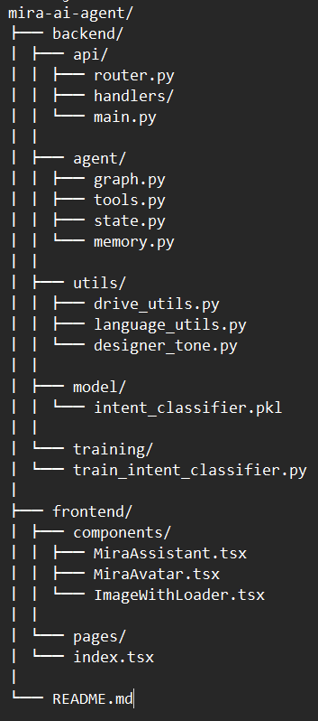

#  Mira AI — Interior Design Assistant

Mira is an AI-powered interior design assistant that helps furniture showrooms and design businesses enhance customer experience, automate consultations, and visualize design ideas in real time.

It combines computer vision, NLP, and generative AI to simulate the experience of working with a professional interior designer.

##  Features

### Smart Design Search
Retrieve hand-drawn interior design sketches based on user descriptions using AI-powered image matching.

### Sketch Generation (SDXL-Turbo)
Generate new interior design layouts from text prompts using Stable Diffusion (SDXL-Turbo).

### Showroom Assistant
Answer business-related queries such as:
- showroom locations
- opening hours
- contact information

### Cost Follow-ups
Respond to pricing-related questions based on selected designs.

### Multilingual Support
- English 🇬🇧
- Italian 🇮🇹

### Intelligent Routing
Hybrid intent detection using:
- Rule-based overrides
- Custom-trained ML classifier
- Keyword fallback system

## 💼 Business Value

Mira helps businesses:

- ⏱ Save time during client consultations  
- 🧠 Assist customers in exploring design ideas faster  
- 🖼️ Visualize concepts without manual sketches  
- 📈 Improve customer engagement and experience  
 

## System Architecture
Frontend (Next.js)
↓
FastAPI Backend
↓
LangGraph (State-based routing)
↓
Intent Router (Rules + Classifier + Fallback)
↓
Tools:

search_tool (image retrieval)

showroom_tool (business info)

sketch_tool (image generation)

cost_tool (pricing logic)

## Project Structure

## How Mira Works

1. User sends a query (text or voice)
2. Language is detected (EN / IT)
3. Intent is classified:
   - search
   - showroom
   - sketch_generation
   - follow_up_cost
   - unsupported
4. LangGraph routes request to correct tool
5. Response is returned with:
   - text
   - images (if applicable)

##  Tech Stack

### Backend
- FastAPI
- Python
- LangGraph

### Frontend
- Next.js
- TypeScript
- Tailwind CSS

### AI Components
- Custom Intent Classifier (Scikit-learn)
- OpenCLIP (image retrieval)
- BLIP (captioning)
- SDXL-Turbo (image generation)

### Storage
- Google Drive (image dataset)

##  Use Cases

- Interior design consultation
- Furniture showroom assistant
- AI-powered client interaction
- Design visualization

##  Limitations

- Sketch generation depends on external GPU (Colab)
- Classifier may misclassify ambiguous queries
- Not designed for general knowledge questions

##  Demo

👉 https://www.loom.com/share/0704a6c397f14cb28ac9c3238b2d8b5d

---

## Future Improvements

- LLM-based routing
- Semantic (embedding) routing
- Production GPU deployment
- Improved UI/UX

---

## 👩‍Author

**Vivian Njuguna**  
AI Developer | Full Stack Engineer  
Founder — Vivi Solutions 

---

## Support

If you like this project, give it a ⭐ on GitHub!
