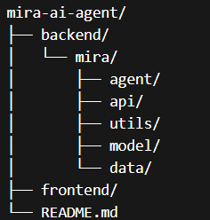

🚀 Mira AI — Interior Design Assistant

Mira AI is an intelligent assistant that helps interior design businesses engage clients, showcase designs, and generate layout ideas through natural conversation.

Demo

👉 Watch the demo here:
https://www.loom.com/share/0704a6c397f14cb28ac9c3238b2d8b5d

Problem

Interior design businesses often face:

-Too many repetitive client questions
-Difficulty showcasing design options quickly
-Slow response times to potential clients
-Limited interaction on websites

✅ Solution — Mira AI

Mira acts as a digital interior design assistant that:

Chats with clients in natural language

Retrieves relevant design sketches instantly

Generates new layout ideas (AI-powered)

Provides showroom information

Supports English & Italian

⚙️ Key Features

🔍 Design Search
Find relevant interior design sketches from a curated dataset

✏️ Sketch Generation
Generate new layouts using AI (SDXL via Colab integration)

🧠 Smart Intent Routing
Custom classifier + fallback logic for accurate responses

🗣️Multilingual Support
Works in both English and Italian

🏬Showroom Assistant
Answers business-related queries (location, contacts, etc.)

🔄 Session Memory
Handles follow-up questions intelligently

How It Works (Simple Overview)

-User sends a query

-Intent is detected (classifier + rules)

-Request is routed to:
 
-Image search

-Sketch generation

-Showroom info
 
-Response is returned with text + images

💼 Business Value

Mira helps businesses:

-Respond instantly to clients (24/7 assistant)

-Increase customer engagement and conversions

-Save time on repetitive inquiries

-Provide a modern, AI-powered experience

Tech Stack

Backend

-FastAPI

-Custom intent classifier (scikit-learn)

-OpenCLIP + BLIP (image retrieval)

-Google Drive (image storage)

AI / Generation

-SDXL Turbo (via Google Colab API)

Frontend

-Next.js

-Tailwind CSS

📁 Project Structure

Getting Started

Backend

-cd backend

-pip install -r requirements.txt

-python run.py

Frontend

-cd frontend

-npm install

-npm run dev

🌍 Languages Supported

-English 🇬🇧

-Italian 🇮🇹

📬 Contact

If you're interested in using Mira for your business or collaboration:

👉 Reach out via LinkedIn 

https://www.linkedin.com/in/vivian-njuguna-njoki91/

email

ntikinjuguna@gmail.com
