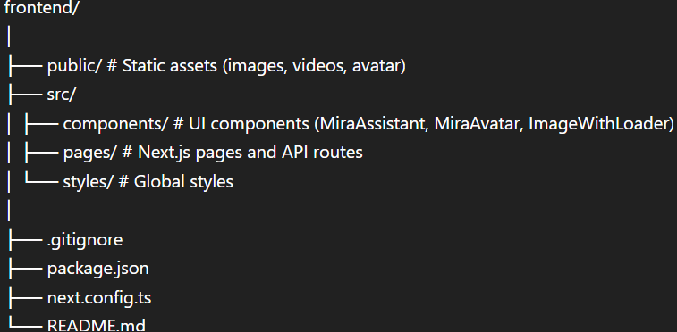

# 🎨 Mira AI — Frontend (Interior Design Assistant)

This is the frontend application for **Mira AI**, an AI-powered interior design assistant that helps users explore, visualize, and generate interior design ideas through a modern conversational interface.

The frontend is built with **Next.js**, **React**, and **Tailwind CSS**, and connects to the Mira backend API.

---

## 🚀 Features

- 💬 Interactive chat interface (Mira Assistant)
- 🖼️ Image-based design search results
- 🤖 AI avatar support (MiraAvatar)
- 🌍 Multilingual support (English / Italian)
- 🔄 Real-time communication with backend API
- 🎨 Clean and responsive UI

---

## 🛠️ Tech Stack

- **Next.js**
- **React**
- **TypeScript**
- **Tailwind CSS**

---

## 📁 Project Structure



---

## ⚙️ Getting Started

### 1. Install dependencies

```bash
npm install
```
2. Run the development server
```bash
npm run dev
```
3. Open in browser

Visit:

👉 http://localhost:3000

🔗 Backend Connection

Make sure the backend is running and update your environment variables:

Create a .env file:
NEXT_PUBLIC_API_URL=http://localhost:8000

🧠 How It Works

User enters a query in the chat interface
Frontend sends request to backend /mira endpoint
Backend processes:
Intent detection
Image search / sketch generation
Frontend displays:
Text response
Images / sketches
Avatar response (if enabled)

🌍 Multilingual Support

Mira supports:

🇬🇧 English
🇮🇹 Italian

Responses automatically adapt based on user input.

📦 Build for Production

```bash
npm run build
npm start
```
🚀 Deployment

You can deploy the frontend easily on:

Vercel (Recommended)
Netlify
Any Node.js hosting platform


📌 Note

This frontend is part of the Mira AI Agent system and works together with the backend service located in:

mira-ai-agent/backend


👩‍💻 Author

Vivian Njuguna

AI Developer | fullstack